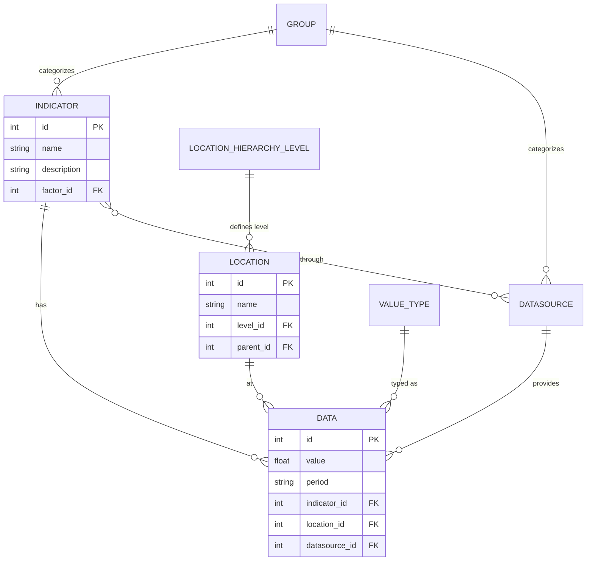

# Development Documentation: API Optimization MSDAT

## 1. Project Overview & Core Objectives
**API Optimization MSDAT** is a specialized backend engine built to manage, optimize, and serve the high-volume datasets required for the **MSDAT (Multi-Sectoral Data Analytics Tool)**.

### What is the project all about?
*   **Data Hub**: Acts as the central repository and distributor for multi-sectoral indicators (Health, Education, Agriculture, etc.).
*   **Speed & Scale**: Solves the performance bottlenecks associated with querying millions of data rows through advanced caching.
*   **Data Integrity**: Implements rigorous validation and audit trails to ensure historical data accuracy.
*   **Automation**: Offloads complex data transformations and cache updates to background workers (Celery).

---

## 2. Company & Platform Details
The project is part of the **MSDAT (Multi-Sectoral Data Analytics Tool)** ecosystem. 

*   **Mission**: To empower decision-makers with real-time, high-quality data through interactive dashboards and reports.
*   **Key Stakeholders**: Researchers, Policymakers, Data Analysts, and Non-Governmental Organizations.
*   **Schema Standard**: Implements the **CARD (Centralized Analytics & Reporting Data)** schema v1.2.0, a standardized format for cross-sectoral indicator tracking.
*   **Support**: For inquiries, contact the development team at kneeraazon@gmail.com.

---

## 3. Technology Stack (Comprehensive List)
| Component | Technology | Version | Description |
| :--- | :--- | :--- | :--- |
| **Backend Framework** | Django | 6.0.2 | Core application engine. |
| **API Framework** | Django REST Framework | 3.16.1 | RESTful interface for all data services. |
| **Language** | Python | 3.14+ | High-level programming for all logic. |
| **Database (Primary)** | PostgreSQL | 16+ | Relational storage for production data. |
| **Database (Dev)** | SQLite | 3.x | Lightweight storage for local development. |
| **Task Queue** | Celery | 5.6.2 | Handles background and scheduled tasks. |
| **Message Broker** | Redis | 7.2.0 | High-speed broker for Celery and caching. |
| **Search Engine** | Elasticsearch | 8.x | (Optional) Advanced full-text search. |
| **Documentation** | drf-yasg | 1.21.x | Auto-generates Swagger/OpenAPI docs. |
| **CORS Management** | django-cors-headers| 4.9.0 | Manages Cross-Origin Resource Sharing. |
| **Filtering** | django-filter | 25.2 | Dynamic query filtering for API endpoints. |

---

## 4. Requirements & Environment Setup

### Prerequisites
*   Python 3.14 or higher
*   PostgreSQL (Staging/Production)
*   Redis (Required for Celery tasks and production caching)
*   Elasticsearch (Optional, for advanced search capabilities)

### Installation
1.  **Clone the Repo**: `git clone <repo_url>`
2.  **Virtual Env**: `python -m venv venv && source venv/bin/activate`
3.  **Dependencies**: `pip install -r requirements.txt`
4.  **Environment Marking**: Use the provided scripts to set the `E4E_ENVVAR_MSDATAPI_ENV` variable:
    *   `source script_bash_mark_as_local.sh` (Local/SQLite)
    *   `source script_bash_mark_as_staging.sh` (Staging/PostgreSQL)
    *   `source script_bash_mark_as_production.sh` (Production/PostgreSQL)

---

## 5. Project Structure
The project follows a modular Django structure organized under the `apps/` namespace:

*   **`core/`**: Central project configuration (settings, URLs, WSGI/ASGI, Celery).
*   **`apps.main/`**: Core data models (Data, Indicator, Location) and base CRUD logic.
*   **`apps.dmi/`**: Data Management Interface for advanced data manipulation.
*   **`apps.data_caches/`**: Management of persistent file and memory caches for high-traffic routes.
*   **`apps.event_trail/`**: Middleware and models for audit logs and request tracking.
*   **`apps.user/`**: Custom user profiles and authentication logic.
*   **`apps.legacy/`**: Adapters for supporting legacy MSDAT data structures.
*   **`shared/`**: Common utilities for logging, pagination, and data conversion.

---

## 6. Database Schema & ERD
The project uses the **CARD (Centralized Analytics & Reporting Data)** schema v1.2.0.

### Core Entities
*   **Data**: The central fact table storing values for indicators at specific locations and periods.
*   **Indicator**: Definitions of metrics being tracked (e.g., "Maternal Mortality Rate").
*   **Location**: Geographic hierarchy (National, State, LGA).
*   **Datasource**: Origins of the data (e.g., "DHIS2", "Census").

### Entity Relationship Diagram (ERD)

---

## 7. API Specifications
All API routes are prefixed with `/api/`.

### Key Endpoints
*   **Authentication**: `POST /api/user/login/` (Returns Token for authorized access).
*   **Core Data Retrieval**:
    *   `GET /api/crud/data/`: Standard data list with extensive filtering (by location, indicator, period, etc.).
    *   `GET /api/data/latest/`: Returns the timestamp of the most recent data upload.
    *   `GET /api/data/location_level/{id}/`: Data filtered by geographic hierarchy level.
    *   `GET /api/data/after_datetime/`: Retrieves data records created or updated after a specific timestamp.
*   **Data Management (DMI)**:
    *   `GET /api/dmi/data/count/`: Total record counts for system health monitoring.
    *   `GET /api/dmi/data/all/`: Bulk retrieval of records (optimized for exports).
*   **Cache Management**:
    *   `GET /api/caches/status/`: Current status (Empty/In-Progress/Completed) of background cache files.
    *   `GET /api/caches/all/update/`: Triggers a manual refresh of all system caches.
*   **Documentation**:
    *   `/` or `/apidoc/swag/`: Interactive Swagger UI for developers.
    *   `/apidoc/redoc/`: ReDoc technical documentation for system integrators.

### Authentication Flow
1.  Client sends credentials to `/api/user/login/`.
2.  Server returns a `Token`.
3.  Client includes the token in the header for all subsequent requests:
    `Authorization: Token <your_token_string>`

---

## 8. Build & Deployment

### Development Workflow
1.  Mark environment as local.
2.  Run migrations: `python manage.py migrate`.
3.  Load seed data: `bash script_load_data.sh`.
4.  Start server: `python manage.py runserver`.

### Production Deployment
*   **Server**: Gunicorn/Uvicorn behind Nginx.
*   **Tasks**: Celery worker must be running (`./script_start_celery.sh`).
*   **Caching**: Redis should be configured in `core/settings/production.py`.
*   **Environment**: Ensure `E4E_ENVVAR_MSDATAPI_ENV` is set to `ENV_PRO_SERVER_PGSQL`.

---

## 9. Optimization & Maintenance
*   **Caching Strategy**: Uses `apps.data_caches` to pre-calculate and store heavy query results.
*   **Audit Trail**: Every request is logged via `apps.event_trail.middleware.TrailRequests`.
*   **Data Matching**: Management command `indicator_datasource_matching` helps maintain data integrity across sources.

---

## 10. Glossary for Non-Developers
*   **API**: The "bridge" that allows different software (like a dashboard and a database) to talk to each other.
*   **Indicator**: A specific data point or metric being tracked, like "HIV Prevalence."
*   **LGA (Local Government Area)**: A specific geographic division used in the data.
*   **Caching**: A technique where the server remembers the answer to a frequent question so it doesn't have to look it up from scratch every time.
*   **Celery**: An automated "helper" that performs long-running tasks in the background without slowing down the main website.
*   **Token**: A digital "key" used by authorized software to access the API securely.
